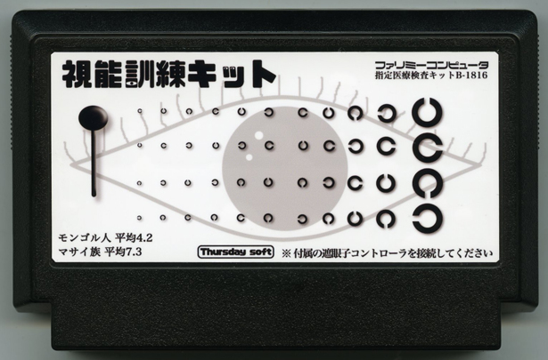

視能訓練キット
=============

[“的封面2016年比赛”](https://itch.io/jam/a-game-by-its-cover-2016)的创建, [（盒）由ヨシカワタダシ设计](http://famicase.com/16/softs/77.html)

>
>
>視能訓練キット
>=============
>ヨシカワタダシ / 打楽器奏者 映像作家
>
>業務用の視能訓練キットです。18インチのテレビ画面から3メートル離れて計測する前提で作られています。指定環境以外の計測は正常に計測出来ません。眼科医や視能訓練士の指導・立ち会いのもと正しく計測を行ってください。方向回答は遮眼子コントローラを使用して入力します。表示から２秒以内に回答しないと見えていないと見なされますのでご注意ください。終わりましたら必ず除菌しておきましょう。

游戏的目的是要尽可能多的圆圈连接越好，用旋转最少和连接印刷机越好。

运行使用[love2d](https://love2d.org)，或等待，直到创建一个二进制版本。
